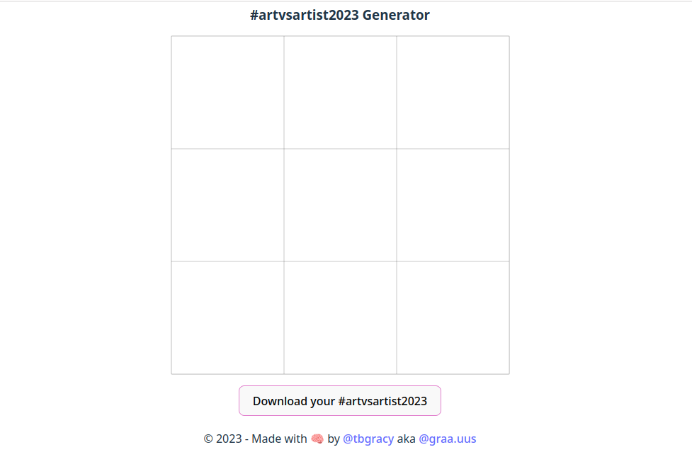

# 🖌️ AVA ⚙️

<center>  </center>

An Art vs Artist Generator that allows users to create side-by-side comparisons of their artwork and themselves, following the popular trend on social media. This project serves as a fun and creative way for artists to showcase their work alongside their persona.

## 🤔 Why

When the #artvsartist trend came in 2023, I didn't have the motivation to open my template on GIMP (Windows and Mac users may use Photoshop) to make my #artvsartist. So I searched for an online generator and stumbled upon Artstation's generator but you needed an account to use it. So (there is a lot of "so") I decide to make my own quickly. As I was still new to React, I found in it an opportunity to upskill.

## ✨ How to use

You can watch a demo of how to use it [there](https://youtu.be/UhW0ufMM3Pk), and test it yourself [here](https://artvsartist.netlify.app/).

## 🚀 Run locally 

If you wanna try the project locally and mess around, follow the steps below.

### Clone the repo

```bash
git clone https://github.com/tbgracy/bubus
```
### Install all the dependencies
```bash
cd ./bubus
npm i
```

### Run the project
```bash
npm run dev
```

## 🤝 Contributing

### Submit a pull request

## 🗺️ Roadmap
- [ ] Dark mode (use context for state management and read a bit for inspiration before coding) (mampiasa radial gradient(s))
- [ ] SEO
- [ ] Add help section
- [ ] Add reset button
- [ ] Add language switch
- [ ] Add border customization